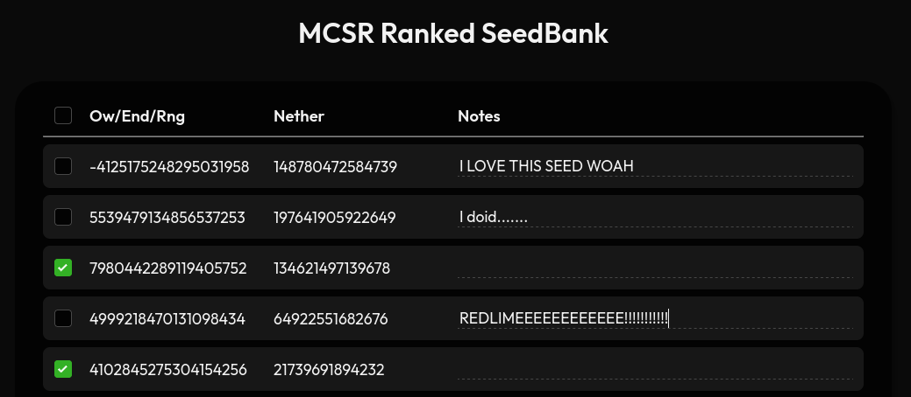
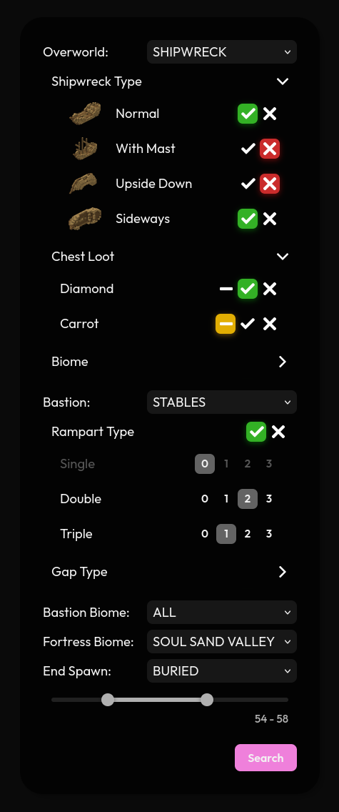
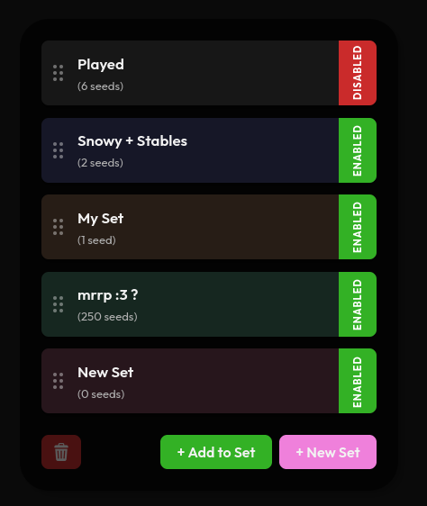

# MCSR Ranked SeedBank

I put together ~2000 ranked seeds in a database and made a site with various filter options that are available in the API.
You can use these for practicing a specific type of seed that you can't consistently get with the current private room filters
[awesomedev.site/ranked-seedbank](https://awesomedev.site/ranked-seedbank/)

## Explanations

- You can use the filter options on the left side to enable/disable settings you want
  - In the Chest Loot filters, yellow means it's not specified whether you get the loot or not
  - Make sure not to make impossible filters like disabling all village types in a village overworld or choosing more than 3 stables ramparts.
  - Some detailed filters will not show any results because there aren't a large enough number of seeds in the seedbank
- When using the sets:
  - Disabled means that the seeds in that set will not show up in future search results
  - You can reorder/rename sets but you can't change the colors in the GUI right now
- If you want a **more permanent storage** you can download the sets data and import the sets from saved files

## Previews

  
  
  

    
    
  

